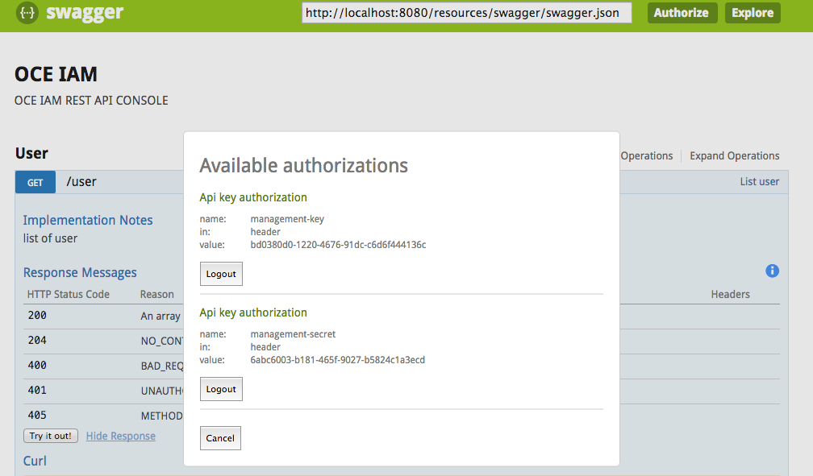

# OCE IAM

## Rest Api Using swagger

Swagger Located at http://localhost:8080/static/swagger/index.html

client-key and client-secret are required which described in `application.yml` file.



## Rest Api Using code

client-key and client-secret are required in http header. ex:


```
curl -X GET \
--header 'Accept: application/json' \
--header 'client-key: my-client-key' \
--header 'client-secret: my-client-secret' \
'http://localhost:8080/rest/v1/scope'
```


