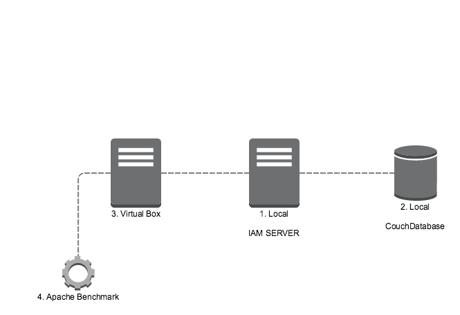
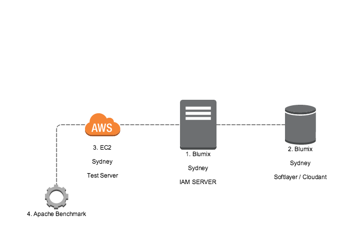
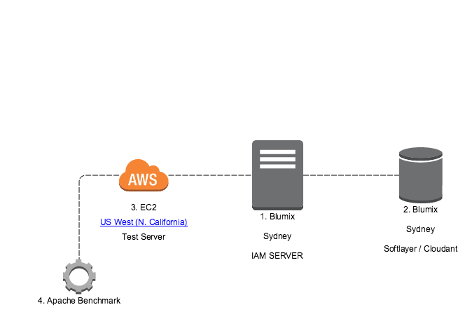
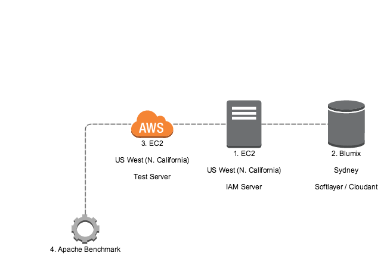

# OCE IAM

## 테스트 환경

### 1. Local



 - 시료 정보

1. 2.3 GHz Intel Core i7 Mac OS X / 16GB

2. 2.3 GHz Intel Core i7 Mac OS X / 16GB

3. 1 cpu Ubuntu 14.04 / 1 GB

4. Apache Benchmark tool

 - IAM 서버 설치 정보

Tomcat 8.0 / Jre 1.8.0 / Heap Memory 2G


### 2. Sydney to Sydney



 - 시료 정보

1. Bluemix

2. Cloudant

3. EC2 t2.micro 1 cpu / 1GB

4. Apache Benchmark tool

 - IAM 서버 설치 정보
 
Tomcat 8.0 / Jre 1.8.0 / Heap Memory 2G


### 3. US to Sydney



 - 시료 정보

1. Bluemix

2. Cloudant

3. EC2 t2.micro 1 cpu / 1GB

4. Apache Benchmark tool

 - IAM 서버 설치 정보
 
Tomcat 8.0 / Jre 1.8.0 / Heap Memory 2G

### 4. Us to Us and Sydney Database



 - 시료 정보

1. EC2 t2.micro 1 cpu / 1GB

2. Cloudant

3. EC2 t2.micro 1 cpu / 1GB

4. Apache Benchmark tool

 - IAM 서버 설치 정보
 
Tomcat 8.0 / Jre 1.8.0 / Heap Memory 2G


## 테스트 수행

### TC-1. 토큰 발급 테스트

토큰 발급 기능 테스트는 IAM 서버의 Password Credentials Flow 토큰 발급을 대상으로 함.


테스트 쓰레드 : 1 / 10 / 50 / 100

쓰레드 반복 횟수 : 5

### TC-2. 토큰 밸리데이트 테스트

토큰 밸리데이션 테스트는 JWT 토큰을 대상으로 함.


## 테스트 결과 (축약)

### TC-1 토큰 발급

1) Local 환경

| 쓰레드 | 반복호출 | 총 리퀘스트 | 총 응답 시간 (s) | 응답 성공률 (%) | 리퀘스트당 소요시간 (ms) |
|--------|----------|-------------|------------------|-----------------|--------------------------|
| 1      | 5        | 5           | 0.255            | 100             | 51.063                   |
| 10     | 5        | 50          | 0.438            | 100             | 8.761                    |
| 50     | 5        | 250         | 1.732            | 100             | 6.93                     |
| 100    | 5        | 500         | 2.952            | 100             | 5.904                    |


2) 시드니(요청지)  -  시드니(블루믹스)

| 쓰레드 | 반복호출 | 총 리퀘스트 | 총 응답 시간 (s) | 응답 성공률 (%) | 리퀘스트당 소요시간 (ms) |
|--------|----------|-------------|------------------|-----------------|--------------------------|
| 1      | 5        | 5           | 0.836            | 100             | 167.25                   |
| 10     | 5        | 50          | 3.884            | 100             | 77.676                   |
| 50     | 5        | 250         | 10.211           | 100             | 40.845                   |
| 100    | 5        | 500         | 32.463           | 100             | 64.925                   |


3) US 캘리포니아(요청지)  -  시드니(블루믹스)

| 쓰레드 | 반복호출 | 총 리퀘스트 | 총 응답 시간 (s) | 응답 성공률 (%) | 리퀘스트당 소요시간 (ms) |
|--------|----------|-------------|------------------|-----------------|--------------------------|
| 1      | 5        | 5           | 2.871            | 100             | 574.141                  |
| 10     | 5        | 50          | 5.552            | 100             | 111.046                  |
| 50     | 5        | 250         | 17.35            | 100             | 69.399                   |
| 100    | 5        | 500         | 32.807           | 100             | 65.615                   |


4) US 캘리포니아(요청지) - US 캘리포니아(IAM 서버) - 시드니(블루믹스 DB)

| 쓰레드 | 반복호출 | 총 리퀘스트 | 총 응답 시간 (s) | 응답 성공률 (%) | 리퀘스트당 소요시간 (ms) |
|--------|----------|-------------|------------------|-----------------|--------------------------|
| 1      | 5        | 5           | 27.116           | 100             | 5423.207                 |
| 10     | 5        | 50          | 29.238           | 100             | 584.752                  |
| 50     | 5        | 250         | 41.736           | 100             | 166.943                  |
| 100    | 5        | 500         | 58.971           | 100             | 117.942                  |

### TC-2 토큰 밸리데이트 (데이터베이스 조회 없음)

1) Local 환경

| 쓰레드 | 반복호출 | 총 리퀘스트 | 총 응답 시간 (s) | 응답 성공률 (%) | 리퀘스트당 소요시간 (ms) |
|--------|----------|-------------|------------------|-----------------|--------------------------|
| 1      | 5        | 5           | 0.008            | 100             | 1.508                    |
| 10     | 5        | 50          | 0.022            | 100             | 0.434                    |
| 50     | 5        | 250         | 0.109            | 100             | 0.436                    |
| 100    | 5        | 500         | 0.212            | 100             | 0.424                    |


2) 시드니(요청지)  -  시드니(블루믹스)

| 쓰레드 | 반복호출 | 총 리퀘스트 | 총 응답 시간 (s) | 응답 성공률 (%) | 리퀘스트당 소요시간 (ms) |
|--------|----------|-------------|------------------|-----------------|--------------------------|
| 1      | 5        | 5           | 0.042            | 100             | 8.365                    |
| 10     | 5        | 50          | 0.081            | 100             | 1.622                    |
| 50     | 5        | 250         | 0.242            | 100             | 0.967                    |
| 100    | 5        | 500         | 0.484            | 100             | 0.968                    |


3) US 캘리포니아(요청지)  -  시드니(블루믹스)

| 쓰레드 | 반복호출 | 총 리퀘스트 | 총 응답 시간 (s) | 응답 성공률 (%) | 리퀘스트당 소요시간 (ms) |
|--------|----------|-------------|------------------|-----------------|--------------------------|
| 1      | 5        | 5           | 2.18             | 100             | 435.924                  |
| 10     | 5        | 50          | 2.181            | 100             | 43.613                   |
| 50     | 5        | 250         | 2.256            | 100             | 9.022                    |
| 100    | 5        | 500         | 2.405            | 100             | 4.809                    |


4) US 캘리포니아(요청지) - US 캘리포니아(IAM 서버) - 시드니(블루믹스 DB)

| 쓰레드 | 반복호출 | 총 리퀘스트 | 총 응답 시간 (s) | 응답 성공률 (%) | 리퀘스트당 소요시간 (ms) |
|--------|----------|-------------|------------------|-----------------|--------------------------|
| 1      | 5        | 5           | 0.033            | 100             | 6.544                    |
| 10     | 5        | 50          | 0.055            | 100             | 1.107                    |
| 50     | 5        | 250         | 0.216            | 100             | 0.865                    |
| 100    | 5        | 500         | 0.344            | 100             | 0.688                    |

## 테스트 결과 (상세)

### 1. Local Test

#### TC-1

1. 쓰레드 1 * 반복 회수 5 = 요청수 5

```
Server Software:        Apache-Coyote/1.1
Server Hostname:        192.168.0.23
Server Port:            8080

Document Path:          /oauth/access_token
Document Length:        723 bytes

Concurrency Level:      1
Time taken for tests:   0.255 seconds
Complete requests:      5
Failed requests:        0
Total transferred:      6460 bytes
Total body sent:        2010
HTML transferred:       3615 bytes
Requests per second:    19.58 [#/sec] (mean)
Time per request:       51.063 [ms] (mean)
Time per request:       51.063 [ms] (mean, across all concurrent requests)
Transfer rate:          24.71 [Kbytes/sec] received
                        7.69 kb/s sent
                        32.40 kb/s total

Connection Times (ms)
              min  mean[+/-sd] median   max
Connect:        0    0   0.0      0       0
Processing:    48   51   2.5     51      55
Waiting:       48   51   2.4     51      54
Total:         48   51   2.5     51      55

Percentage of the requests served within a certain time (ms)
  50%     51
  66%     51
  75%     51
  80%     55
  90%     55
  95%     55
  98%     55
  99%     55
 100%     55 (longest request)
```


2. 쓰레드 10 * 반복 회수 5 = 요청수 50

```
Server Software:        Apache-Coyote/1.1
Server Hostname:        192.168.0.23
Server Port:            8080

Document Path:          /oauth/access_token
Document Length:        723 bytes

Concurrency Level:      10
Time taken for tests:   0.438 seconds
Complete requests:      50
Failed requests:        0
Total transferred:      64600 bytes
Total body sent:        20100
HTML transferred:       36150 bytes
Requests per second:    114.14 [#/sec] (mean)
Time per request:       87.613 [ms] (mean)
Time per request:       8.761 [ms] (mean, across all concurrent requests)
Transfer rate:          144.01 [Kbytes/sec] received
                        44.81 kb/s sent
                        188.82 kb/s total

Connection Times (ms)
              min  mean[+/-sd] median   max
Connect:        0    1   0.4      1       2
Processing:    74   86   5.3     87      99
Waiting:       74   86   5.1     86      97
Total:         75   87   5.4     87      99

Percentage of the requests served within a certain time (ms)
  50%     87
  66%     90
  75%     91
  80%     93
  90%     95
  95%     95
  98%     99
  99%     99
 100%     99 (longest request)
```

3. 쓰레드 50 * 반복 회수 5 = 요청수 250

```
Server Software:        Apache-Coyote/1.1
Server Hostname:        192.168.0.23
Server Port:            8080

Document Path:          /oauth/access_token
Document Length:        723 bytes

Concurrency Level:      50
Time taken for tests:   1.732 seconds
Complete requests:      250
Failed requests:        0
Total transferred:      323000 bytes
Total body sent:        100500
HTML transferred:       180750 bytes
Requests per second:    144.30 [#/sec] (mean)
Time per request:       346.496 [ms] (mean)
Time per request:       6.930 [ms] (mean, across all concurrent requests)
Transfer rate:          182.07 [Kbytes/sec] received
                        56.65 kb/s sent
                        238.72 kb/s total

Connection Times (ms)
              min  mean[+/-sd] median   max
Connect:        0    2   1.9      2       8
Processing:   270  342  33.1    340     426
Waiting:      270  341  33.0    339     426
Total:        272  344  32.9    343     426

Percentage of the requests served within a certain time (ms)
  50%    343
  66%    356
  75%    366
  80%    371
  90%    389
  95%    404
  98%    413
  99%    418
 100%    426 (longest request)
```

 
4. 쓰레드 100 * 반복 회수 5 = 요청수 500

```
Server Software:        Apache-Coyote/1.1
Server Hostname:        192.168.0.23
Server Port:            8080

Document Path:          /oauth/access_token
Document Length:        723 bytes

Concurrency Level:      100
Time taken for tests:   2.952 seconds
Complete requests:      500
Failed requests:        0
Total transferred:      646000 bytes
Total body sent:        201000
HTML transferred:       361500 bytes
Requests per second:    169.37 [#/sec] (mean)
Time per request:       590.407 [ms] (mean)
Time per request:       5.904 [ms] (mean, across all concurrent requests)
Transfer rate:          213.70 [Kbytes/sec] received
                        66.49 kb/s sent
                        280.20 kb/s total

Connection Times (ms)
              min  mean[+/-sd] median   max
Connect:        0    3   3.7      2      15
Processing:   463  582  47.3    581     693
Waiting:      463  582  47.4    580     693
Total:        468  586  46.1    582     694

Percentage of the requests served within a certain time (ms)
  50%    582
  66%    604
  75%    620
  80%    630
  90%    650
  95%    657
  98%    673
  99%    684
 100%    694 (longest request)
```

#### TC-2

1. 쓰레드 1 * 반복 회수 5 = 요청수 5

```
Server Software:        Apache-Coyote/1.1
Server Hostname:        192.168.0.23
Server Port:            8080

Document Path:          /oauth/token_info?access_token=eyJhbGciOiJIUzI1NiJ9.eyJleHAiOjE0NjIzNTE5MjksImNvbnRleHQiOnsic2NvcGVzIjoiZm9ybTpjcmVhdGUiLCJ1c2VySWQiOiI3OWRhNzU5ZmIzYjI0NmUzYmZiN2ZmYTljZmUyODFhNiIsImNsaWVudEtleSI6ImJmYTMzOTBlLTJhZTMtNGFkOC1hMzA5LWU4NjdjZDk0OTA0OCIsInVzZXJOYW1lIjoidXNlcjEiLCJtYW5hZ2VtZW50SWQiOiI4NTFmYjcxNWQzMzk0OTA1OTE5MTQ1N2NhZTRjYWU2MiIsInJlZnJlc2hUb2tlbiI6ImRkNDZlYTFkLThmYmUtNDc4ZS05ZmMwLTUxZWMxNTM5YzlmNiIsInR5cGUiOiJ1c2VyIiwiY2xpZW50SWQiOiI5MzViYjI5Mzc3OTE0NzVjYTRmZTI4ZjRiZTc3MGU5ZCJ9LCJpc3MiOiJvY2UuaWFtIiwiY2xhaW0iOnsidGVuYW50IjoiYTEsYjEifSwiaWF0IjoxNDYyMzQ4MzI5fQ.llsz1xvW03pwgX0LLP5zQPYKHCzFI6A8HG_KhXd8EWE
Document Length:        541 bytes

Concurrency Level:      1
Time taken for tests:   0.008 seconds
Complete requests:      5
Failed requests:        0
Total transferred:      5550 bytes
HTML transferred:       2705 bytes
Requests per second:    663.13 [#/sec] (mean)
Time per request:       1.508 [ms] (mean)
Time per request:       1.508 [ms] (mean, across all concurrent requests)
Transfer rate:          718.82 [Kbytes/sec] received

Connection Times (ms)
              min  mean[+/-sd] median   max
Connect:        0    0   0.1      0       0
Processing:     1    1   0.3      1       2
Waiting:        1    1   0.3      1       2
Total:          1    1   0.3      1       2

Percentage of the requests served within a certain time (ms)
  50%      1
  66%      1
  75%      1
  80%      2
  90%      2
  95%      2
  98%      2
  99%      2
 100%      2 (longest request)
```

2. 쓰레드 10 * 반복 회수 5 = 요청수 50

```
Server Software:        Apache-Coyote/1.1
Server Hostname:        192.168.0.23
Server Port:            8080

Document Path:          /oauth/token_info?access_token=eyJhbGciOiJIUzI1NiJ9.eyJleHAiOjE0NjIzNTE5MjksImNvbnRleHQiOnsic2NvcGVzIjoiZm9ybTpjcmVhdGUiLCJ1c2VySWQiOiI3OWRhNzU5ZmIzYjI0NmUzYmZiN2ZmYTljZmUyODFhNiIsImNsaWVudEtleSI6ImJmYTMzOTBlLTJhZTMtNGFkOC1hMzA5LWU4NjdjZDk0OTA0OCIsInVzZXJOYW1lIjoidXNlcjEiLCJtYW5hZ2VtZW50SWQiOiI4NTFmYjcxNWQzMzk0OTA1OTE5MTQ1N2NhZTRjYWU2MiIsInJlZnJlc2hUb2tlbiI6ImRkNDZlYTFkLThmYmUtNDc4ZS05ZmMwLTUxZWMxNTM5YzlmNiIsInR5cGUiOiJ1c2VyIiwiY2xpZW50SWQiOiI5MzViYjI5Mzc3OTE0NzVjYTRmZTI4ZjRiZTc3MGU5ZCJ9LCJpc3MiOiJvY2UuaWFtIiwiY2xhaW0iOnsidGVuYW50IjoiYTEsYjEifSwiaWF0IjoxNDYyMzQ4MzI5fQ.llsz1xvW03pwgX0LLP5zQPYKHCzFI6A8HG_KhXd8EWE
Document Length:        541 bytes

Concurrency Level:      10
Time taken for tests:   0.022 seconds
Complete requests:      50
Failed requests:        0
Total transferred:      55500 bytes
HTML transferred:       27050 bytes
Requests per second:    2305.63 [#/sec] (mean)
Time per request:       4.337 [ms] (mean)
Time per request:       0.434 [ms] (mean, across all concurrent requests)
Transfer rate:          2499.27 [Kbytes/sec] received

Connection Times (ms)
              min  mean[+/-sd] median   max
Connect:        0    1   0.7      1       3
Processing:     1    3   0.6      3       4
Waiting:        1    2   0.7      2       3
Total:          2    4   0.8      4       6

Percentage of the requests served within a certain time (ms)
  50%      4
  66%      4
  75%      4
  80%      5
  90%      5
  95%      5
  98%      6
  99%      6
 100%      6 (longest request)
```

3. 쓰레드 50 * 반복 회수 5 = 요청수 250

```
Server Software:        Apache-Coyote/1.1
Server Hostname:        192.168.0.23
Server Port:            8080

Document Path:          /oauth/token_info?access_token=eyJhbGciOiJIUzI1NiJ9.eyJleHAiOjE0NjIzNTE5MjksImNvbnRleHQiOnsic2NvcGVzIjoiZm9ybTpjcmVhdGUiLCJ1c2VySWQiOiI3OWRhNzU5ZmIzYjI0NmUzYmZiN2ZmYTljZmUyODFhNiIsImNsaWVudEtleSI6ImJmYTMzOTBlLTJhZTMtNGFkOC1hMzA5LWU4NjdjZDk0OTA0OCIsInVzZXJOYW1lIjoidXNlcjEiLCJtYW5hZ2VtZW50SWQiOiI4NTFmYjcxNWQzMzk0OTA1OTE5MTQ1N2NhZTRjYWU2MiIsInJlZnJlc2hUb2tlbiI6ImRkNDZlYTFkLThmYmUtNDc4ZS05ZmMwLTUxZWMxNTM5YzlmNiIsInR5cGUiOiJ1c2VyIiwiY2xpZW50SWQiOiI5MzViYjI5Mzc3OTE0NzVjYTRmZTI4ZjRiZTc3MGU5ZCJ9LCJpc3MiOiJvY2UuaWFtIiwiY2xhaW0iOnsidGVuYW50IjoiYTEsYjEifSwiaWF0IjoxNDYyMzQ4MzI5fQ.llsz1xvW03pwgX0LLP5zQPYKHCzFI6A8HG_KhXd8EWE
Document Length:        541 bytes

Concurrency Level:      50
Time taken for tests:   0.109 seconds
Complete requests:      250
Failed requests:        0
Total transferred:      277500 bytes
HTML transferred:       135250 bytes
Requests per second:    2294.99 [#/sec] (mean)
Time per request:       21.787 [ms] (mean)
Time per request:       0.436 [ms] (mean, across all concurrent requests)
Transfer rate:          2487.73 [Kbytes/sec] received

Connection Times (ms)
              min  mean[+/-sd] median   max
Connect:        1    7   3.7      6      13
Processing:     1   14   5.5     14      25
Waiting:        1   10   2.8     11      14
Total:          8   20   5.8     21      31

Percentage of the requests served within a certain time (ms)
  50%     21
  66%     24
  75%     25
  80%     25
  90%     27
  95%     28
  98%     30
  99%     31
 100%     31 (longest request)
```

4. 쓰레드 100 * 반복 회수 5 = 요청수 500

```
Server Software:        Apache-Coyote/1.1
Server Hostname:        192.168.0.23
Server Port:            8080

Document Path:          /oauth/token_info?access_token=eyJhbGciOiJIUzI1NiJ9.eyJleHAiOjE0NjIzNTE5MjksImNvbnRleHQiOnsic2NvcGVzIjoiZm9ybTpjcmVhdGUiLCJ1c2VySWQiOiI3OWRhNzU5ZmIzYjI0NmUzYmZiN2ZmYTljZmUyODFhNiIsImNsaWVudEtleSI6ImJmYTMzOTBlLTJhZTMtNGFkOC1hMzA5LWU4NjdjZDk0OTA0OCIsInVzZXJOYW1lIjoidXNlcjEiLCJtYW5hZ2VtZW50SWQiOiI4NTFmYjcxNWQzMzk0OTA1OTE5MTQ1N2NhZTRjYWU2MiIsInJlZnJlc2hUb2tlbiI6ImRkNDZlYTFkLThmYmUtNDc4ZS05ZmMwLTUxZWMxNTM5YzlmNiIsInR5cGUiOiJ1c2VyIiwiY2xpZW50SWQiOiI5MzViYjI5Mzc3OTE0NzVjYTRmZTI4ZjRiZTc3MGU5ZCJ9LCJpc3MiOiJvY2UuaWFtIiwiY2xhaW0iOnsidGVuYW50IjoiYTEsYjEifSwiaWF0IjoxNDYyMzQ4MzI5fQ.llsz1xvW03pwgX0LLP5zQPYKHCzFI6A8HG_KhXd8EWE
Document Length:        541 bytes

Concurrency Level:      100
Time taken for tests:   0.212 seconds
Complete requests:      500
Failed requests:        0
Total transferred:      555000 bytes
HTML transferred:       270500 bytes
Requests per second:    2359.58 [#/sec] (mean)
Time per request:       42.380 [ms] (mean)
Time per request:       0.424 [ms] (mean, across all concurrent requests)
Transfer rate:          2557.75 [Kbytes/sec] received

Connection Times (ms)
              min  mean[+/-sd] median   max
Connect:        1   12   5.5     12      26
Processing:     4   27  12.0     26      51
Waiting:        4   19   6.9     18      31
Total:         18   39  12.1     38      65

Percentage of the requests served within a certain time (ms)
  50%     38
  66%     48
  75%     48
  80%     51
  90%     55
  95%     60
  98%     64
  99%     64
 100%     65 (longest request)
```

### 2. Sydney to Sydney Test

#### TC-1

1. 쓰레드 1 * 반복 회수 5 = 요청수 5

```
Server Software:        Apache-Coyote/1.1
Server Hostname:        iam.au-syd.mybluemix.net
Server Port:            80

Document Path:          /oauth/access_token
Document Length:        723 bytes

Concurrency Level:      1
Time taken for tests:   0.836 seconds
Complete requests:      5
Failed requests:        0
Total transferred:      7195 bytes
Total body sent:        2045
HTML transferred:       3615 bytes
Requests per second:    5.98 [#/sec] (mean)
Time per request:       167.250 [ms] (mean)
Time per request:       167.250 [ms] (mean, across all concurrent requests)
Transfer rate:          8.40 [Kbytes/sec] received
                        2.39 kb/s sent
                        10.79 kb/s total

Connection Times (ms)
              min  mean[+/-sd] median   max
Connect:        2    2   0.5      2       3
Processing:   118  165  78.6    140     305
Waiting:      118  165  78.6    140     305
Total:        121  167  78.5    142     306

Percentage of the requests served within a certain time (ms)
  50%    137
  66%    147
  75%    147
  80%    306
  90%    306
  95%    306
  98%    306
  99%    306
 100%    306 (longest request)
```

2. 쓰레드 10 * 반복 회수 5 = 요청수 50

```
Server Software:        Apache-Coyote/1.1
Server Hostname:        iam.au-syd.mybluemix.net
Server Port:            80

Document Path:          /oauth/access_token
Document Length:        723 bytes

Concurrency Level:      10
Time taken for tests:   3.884 seconds
Complete requests:      50
Failed requests:        0
Total transferred:      71946 bytes
Total body sent:        20450
HTML transferred:       36150 bytes
Requests per second:    12.87 [#/sec] (mean)
Time per request:       776.765 [ms] (mean)
Time per request:       77.676 [ms] (mean, across all concurrent requests)
Transfer rate:          18.09 [Kbytes/sec] received
                        5.14 kb/s sent
                        23.23 kb/s total

Connection Times (ms)
              min  mean[+/-sd] median   max
Connect:        2    2   0.1      2       2
Processing:   448  760 251.8    654    1302
Waiting:      448  760 251.8    654    1301
Total:        450  762 251.8    656    1304

Percentage of the requests served within a certain time (ms)
  50%    656
  66%    678
  75%    701
  80%   1202
  90%   1251
  95%   1261
  98%   1304
  99%   1304
 100%   1304 (longest request)
```

3. 쓰레드 50 * 반복 회수 5 = 요청수 250

```
Server Software:        Apache-Coyote/1.1
Server Hostname:        iam.au-syd.mybluemix.net
Server Port:            80

Document Path:          /oauth/access_token
Document Length:        723 bytes

Concurrency Level:      50
Time taken for tests:   10.211 seconds
Complete requests:      250
Failed requests:        0
Total transferred:      359728 bytes
Total body sent:        102250
HTML transferred:       180750 bytes
Requests per second:    24.48 [#/sec] (mean)
Time per request:       2042.231 [ms] (mean)
Time per request:       40.845 [ms] (mean, across all concurrent requests)
Transfer rate:          34.40 [Kbytes/sec] received
                        9.78 kb/s sent
                        44.18 kb/s total

Connection Times (ms)
              min  mean[+/-sd] median   max
Connect:        2    2   0.6      2       6
Processing:   246 1957 922.8   1870    3369
Waiting:      246 1956 922.8   1870    3369
Total:        247 1959 923.0   1872    3371

Percentage of the requests served within a certain time (ms)
  50%   1872
  66%   2437
  75%   2830
  80%   2962
  90%   3265
  95%   3300
  98%   3307
  99%   3308
 100%   3371 (longest request)
```

4. 쓰레드 100 * 반복 회수 5 = 요청수 500

```
Server Software:        Apache-Coyote/1.1
Server Hostname:        iam.au-syd.mybluemix.net
Server Port:            80

Document Path:          /oauth/access_token
Document Length:        723 bytes

Concurrency Level:      100
Time taken for tests:   32.463 seconds
Complete requests:      500
Failed requests:        0
Total transferred:      719494 bytes
Total body sent:        204500
HTML transferred:       361500 bytes
Requests per second:    15.40 [#/sec] (mean)
Time per request:       6492.529 [ms] (mean)
Time per request:       64.925 [ms] (mean, across all concurrent requests)
Transfer rate:          21.64 [Kbytes/sec] received
                        6.15 kb/s sent
                        27.80 kb/s total

Connection Times (ms)
              min  mean[+/-sd] median   max
Connect:        1    3   2.3      2      10
Processing:  5929 6465 291.2   6344    7256
Waiting:     5929 6465 291.2   6344    7256
Total:       5931 6468 293.1   6346    7261

Percentage of the requests served within a certain time (ms)
  50%   6346
  66%   6400
  75%   6500
  80%   6823
  90%   7064
  95%   7078
  98%   7145
  99%   7162
 100%   7261 (longest request)
```

#### TC-2

1. 쓰레드 1 * 반복 회수 5 = 요청수 5

```
Server Software:        Apache-Coyote/1.1
Server Hostname:        iam.au-syd.mybluemix.net
Server Port:            80

Document Path:          /oauth/token_info?access_token=eyJhbGciOiJIUzI1NiJ9.eyJpc3MiOiJvY2UuaWFtIiwiY29udGV4dCI6eyJjbGllbnRJZCI6ImE0YTU3OTM1N2NlZjQ2MTc4ZTVjNjZkMWQ3ZTZkN2I0IiwiY2xpZW50S2V5IjoiNTRhNzA4NDAtNDU1OS00ODBiLTkwNzgtODE5YmYyMzJiNDE5IiwibWFuYWdlbWVudElkIjoiZWFlODdlZDVlNTgwNGZmZWIwNTUwYTYxZDc4NjI5ODAiLCJzY29wZXMiOiJmb3JtOmNyZWF0ZSIsInVzZXJOYW1lIjoidXNlcjEiLCJ0eXBlIjoidXNlciIsInVzZXJJZCI6IjQwMmUxMmZjYzBlZjRiYWRhY2I2MDNiOWVmNmRiZGUwIiwicmVmcmVzaFRva2VuIjoiZDE2NTk3ZWEtMTY0ZC00MGM5LWIwZjktNjY1ZGVlM2M0MWZmIn0sImNsYWltIjp7InRlbmFudCI6ImExLGIxIn0sImV4cCI6MTQ2MjM1MzEyOCwiaWF0IjoxNDYyMzQ5NTI4fQ.f8annLezGeBWlUWH5dqbipi6FgcZAaO7jxmzUVCVjYM
Document Length:        541 bytes

Concurrency Level:      1
Time taken for tests:   0.042 seconds
Complete requests:      5
Failed requests:        0
Total transferred:      6285 bytes
HTML transferred:       2705 bytes
Requests per second:    119.55 [#/sec] (mean)
Time per request:       8.365 [ms] (mean)
Time per request:       8.365 [ms] (mean, across all concurrent requests)
Transfer rate:          146.75 [Kbytes/sec] received

Connection Times (ms)
              min  mean[+/-sd] median   max
Connect:        1    2   0.1      2       2
Processing:     6    7   0.7      7       8
Waiting:        6    7   0.7      7       8
Total:          8    8   0.7      8       9

Percentage of the requests served within a certain time (ms)
  50%      8
  66%      8
  75%      8
  80%      9
  90%      9
  95%      9
  98%      9
  99%      9
 100%      9 (longest request)
```

2. 쓰레드 10 * 반복 회수 5 = 요청수 50

```
Server Software:        Apache-Coyote/1.1
Server Hostname:        iam.au-syd.mybluemix.net
Server Port:            80

Document Path:          /oauth/token_info?access_token=eyJhbGciOiJIUzI1NiJ9.eyJpc3MiOiJvY2UuaWFtIiwiY29udGV4dCI6eyJjbGllbnRJZCI6ImE0YTU3OTM1N2NlZjQ2MTc4ZTVjNjZkMWQ3ZTZkN2I0IiwiY2xpZW50S2V5IjoiNTRhNzA4NDAtNDU1OS00ODBiLTkwNzgtODE5YmYyMzJiNDE5IiwibWFuYWdlbWVudElkIjoiZWFlODdlZDVlNTgwNGZmZWIwNTUwYTYxZDc4NjI5ODAiLCJzY29wZXMiOiJmb3JtOmNyZWF0ZSIsInVzZXJOYW1lIjoidXNlcjEiLCJ0eXBlIjoidXNlciIsInVzZXJJZCI6IjQwMmUxMmZjYzBlZjRiYWRhY2I2MDNiOWVmNmRiZGUwIiwicmVmcmVzaFRva2VuIjoiZDE2NTk3ZWEtMTY0ZC00MGM5LWIwZjktNjY1ZGVlM2M0MWZmIn0sImNsYWltIjp7InRlbmFudCI6ImExLGIxIn0sImV4cCI6MTQ2MjM1MzEyOCwiaWF0IjoxNDYyMzQ5NTI4fQ.f8annLezGeBWlUWH5dqbipi6FgcZAaO7jxmzUVCVjYM
Document Length:        541 bytes

Concurrency Level:      10
Time taken for tests:   0.081 seconds
Complete requests:      50
Failed requests:        0
Total transferred:      62850 bytes
HTML transferred:       27050 bytes
Requests per second:    616.57 [#/sec] (mean)
Time per request:       16.219 [ms] (mean)
Time per request:       1.622 [ms] (mean, across all concurrent requests)
Transfer rate:          756.86 [Kbytes/sec] received

Connection Times (ms)
              min  mean[+/-sd] median   max
Connect:        1    2   0.1      2       2
Processing:     6   14   9.1     10      50
Waiting:        5   14   9.1     10      50
Total:          7   15   9.1     12      51

Percentage of the requests served within a certain time (ms)
  50%     12
  66%     14
  75%     18
  80%     21
  90%     26
  95%     40
  98%     51
  99%     51
 100%     51 (longest request)
```

3. 쓰레드 50 * 반복 회수 5 = 요청수 250

```
Server Software:        Apache-Coyote/1.1
Server Hostname:        iam.au-syd.mybluemix.net
Server Port:            80

Document Path:          /oauth/token_info?access_token=eyJhbGciOiJIUzI1NiJ9.eyJpc3MiOiJvY2UuaWFtIiwiY29udGV4dCI6eyJjbGllbnRJZCI6ImE0YTU3OTM1N2NlZjQ2MTc4ZTVjNjZkMWQ3ZTZkN2I0IiwiY2xpZW50S2V5IjoiNTRhNzA4NDAtNDU1OS00ODBiLTkwNzgtODE5YmYyMzJiNDE5IiwibWFuYWdlbWVudElkIjoiZWFlODdlZDVlNTgwNGZmZWIwNTUwYTYxZDc4NjI5ODAiLCJzY29wZXMiOiJmb3JtOmNyZWF0ZSIsInVzZXJOYW1lIjoidXNlcjEiLCJ0eXBlIjoidXNlciIsInVzZXJJZCI6IjQwMmUxMmZjYzBlZjRiYWRhY2I2MDNiOWVmNmRiZGUwIiwicmVmcmVzaFRva2VuIjoiZDE2NTk3ZWEtMTY0ZC00MGM5LWIwZjktNjY1ZGVlM2M0MWZmIn0sImNsYWltIjp7InRlbmFudCI6ImExLGIxIn0sImV4cCI6MTQ2MjM1MzEyOCwiaWF0IjoxNDYyMzQ5NTI4fQ.f8annLezGeBWlUWH5dqbipi6FgcZAaO7jxmzUVCVjYM
Document Length:        541 bytes

Concurrency Level:      50
Time taken for tests:   0.242 seconds
Complete requests:      250
Failed requests:        0
Total transferred:      314231 bytes
HTML transferred:       135250 bytes
Requests per second:    1034.36 [#/sec] (mean)
Time per request:       48.339 [ms] (mean)
Time per request:       0.967 [ms] (mean, across all concurrent requests)
Transfer rate:          1269.64 [Kbytes/sec] received

Connection Times (ms)
              min  mean[+/-sd] median   max
Connect:        2    5   8.5      2      42
Processing:     8   40  19.7     39     101
Waiting:        8   40  19.7     39     101
Total:         10   45  19.1     45     103

Percentage of the requests served within a certain time (ms)
  50%     45
  66%     52
  75%     57
  80%     61
  90%     71
  95%     80
  98%     92
  99%     94
 100%    103 (longest request)
```

4. 쓰레드 100 * 반복 회수 5 = 요청수 500


```
Server Software:        Apache-Coyote/1.1
Server Hostname:        iam.au-syd.mybluemix.net
Server Port:            80

Document Path:          /oauth/token_info?access_token=eyJhbGciOiJIUzI1NiJ9.eyJpc3MiOiJvY2UuaWFtIiwiY29udGV4dCI6eyJjbGllbnRJZCI6ImE0YTU3OTM1N2NlZjQ2MTc4ZTVjNjZkMWQ3ZTZkN2I0IiwiY2xpZW50S2V5IjoiNTRhNzA4NDAtNDU1OS00ODBiLTkwNzgtODE5YmYyMzJiNDE5IiwibWFuYWdlbWVudElkIjoiZWFlODdlZDVlNTgwNGZmZWIwNTUwYTYxZDc4NjI5ODAiLCJzY29wZXMiOiJmb3JtOmNyZWF0ZSIsInVzZXJOYW1lIjoidXNlcjEiLCJ0eXBlIjoidXNlciIsInVzZXJJZCI6IjQwMmUxMmZjYzBlZjRiYWRhY2I2MDNiOWVmNmRiZGUwIiwicmVmcmVzaFRva2VuIjoiZDE2NTk3ZWEtMTY0ZC00MGM5LWIwZjktNjY1ZGVlM2M0MWZmIn0sImNsYWltIjp7InRlbmFudCI6ImExLGIxIn0sImV4cCI6MTQ2MjM1MzEyOCwiaWF0IjoxNDYyMzQ5NTI4fQ.f8annLezGeBWlUWH5dqbipi6FgcZAaO7jxmzUVCVjYM
Document Length:        541 bytes

Concurrency Level:      100
Time taken for tests:   0.484 seconds
Complete requests:      500
Failed requests:        0
Total transferred:      628445 bytes
HTML transferred:       270500 bytes
Requests per second:    1032.64 [#/sec] (mean)
Time per request:       96.839 [ms] (mean)
Time per request:       0.968 [ms] (mean, across all concurrent requests)
Transfer rate:          1267.49 [Kbytes/sec] received

Connection Times (ms)
              min  mean[+/-sd] median   max
Connect:        1    2   1.1      2       6
Processing:     9   86  66.2     67     407
Waiting:        9   86  66.2     67     407
Total:         11   89  66.7     70     411

Percentage of the requests served within a certain time (ms)
  50%     70
  66%    101
  75%    120
  80%    135
  90%    173
  95%    219
  98%    267
  99%    341
 100%    411 (longest request)
```

### 3. US to Sydney Test

#### TC-1

1. 쓰레드 1 * 반복 회수 5 = 요청수 5

```
Server Software:        Apache-Coyote/1.1
Server Hostname:        iam.au-syd.mybluemix.net
Server Port:            80

Document Path:          /oauth/access_token
Document Length:        723 bytes

Concurrency Level:      1
Time taken for tests:   2.871 seconds
Complete requests:      5
Failed requests:        0
Total transferred:      7205 bytes
Total body sent:        2045
HTML transferred:       3615 bytes
Requests per second:    1.74 [#/sec] (mean)
Time per request:       574.141 [ms] (mean)
Time per request:       574.141 [ms] (mean, across all concurrent requests)
Transfer rate:          2.45 [Kbytes/sec] received
                        0.70 kb/s sent
                        3.15 kb/s total

Connection Times (ms)
              min  mean[+/-sd] median   max
Connect:      213  214   1.4    215     216
Processing:   350  360  11.0    362     375
Waiting:      350  360  11.0    362     375
Total:        562  574  10.9    576     590

Percentage of the requests served within a certain time (ms)
  50%    574
  66%    579
  75%    579
  80%    590
  90%    590
  95%    590
  98%    590
  99%    590
 100%    590 (longest request)
```

2. 쓰레드 10 * 반복 회수 5 = 요청수 50

```
Server Software:        Apache-Coyote/1.1
Server Hostname:        iam.au-syd.mybluemix.net
Server Port:            80

Document Path:          /oauth/access_token
Document Length:        723 bytes

Concurrency Level:      10
Time taken for tests:   5.552 seconds
Complete requests:      50
Failed requests:        0
Total transferred:      72050 bytes
Total body sent:        20450
HTML transferred:       36150 bytes
Requests per second:    9.01 [#/sec] (mean)
Time per request:       1110.456 [ms] (mean)
Time per request:       111.046 [ms] (mean, across all concurrent requests)
Transfer rate:          12.67 [Kbytes/sec] received
                        3.60 kb/s sent
                        16.27 kb/s total

Connection Times (ms)
              min  mean[+/-sd] median   max
Connect:      209  214   6.2    213     252
Processing:   721  893 101.2    854    1233
Waiting:      720  893 101.2    854    1233
Total:        932 1107 100.9   1069    1442

Percentage of the requests served within a certain time (ms)
  50%   1069
  66%   1133
  75%   1141
  80%   1252
  90%   1269
  95%   1276
  98%   1442
  99%   1442
 100%   1442 (longest request)
```

3. 쓰레드 50 * 반복 회수 5 = 요청수 250

```
Server Software:        Apache-Coyote/1.1
Server Hostname:        iam.au-syd.mybluemix.net
Server Port:            80

Document Path:          /oauth/access_token
Document Length:        723 bytes

Concurrency Level:      50
Time taken for tests:   17.350 seconds
Complete requests:      250
Failed requests:        0
Total transferred:      360246 bytes
Total body sent:        102250
HTML transferred:       180750 bytes
Requests per second:    14.41 [#/sec] (mean)
Time per request:       3469.944 [ms] (mean)
Time per request:       69.399 [ms] (mean, across all concurrent requests)
Transfer rate:          20.28 [Kbytes/sec] received
                        5.76 kb/s sent
                        26.03 kb/s total

Connection Times (ms)
              min  mean[+/-sd] median   max
Connect:      209  214   2.4    214     218
Processing:   776 3134 541.9   3436    3593
Waiting:      776 3134 541.9   3436    3593
Total:        993 3348 541.9   3649    3810

Percentage of the requests served within a certain time (ms)
  50%   3649
  66%   3669
  75%   3677
  80%   3680
  90%   3690
  95%   3697
  98%   3702
  99%   3703
 100%   3810 (longest request)
```

4. 쓰레드 100 * 반복 회수 5 = 요청수 500

```
Server Software:        Apache-Coyote/1.1
Server Hostname:        iam.au-syd.mybluemix.net
Server Port:            80

Document Path:          /oauth/access_token
Document Length:        723 bytes

Concurrency Level:      100
Time taken for tests:   32.807 seconds
Complete requests:      500
Failed requests:        0
Total transferred:      720476 bytes
Total body sent:        204500
HTML transferred:       361500 bytes
Requests per second:    15.24 [#/sec] (mean)
Time per request:       6561.476 [ms] (mean)
Time per request:       65.615 [ms] (mean, across all concurrent requests)
Transfer rate:          21.45 [Kbytes/sec] received
                        6.09 kb/s sent
                        27.53 kb/s total

Connection Times (ms)
              min  mean[+/-sd] median   max
Connect:      209  214   2.9    214     238
Processing:   581 6198 869.6   6389    6776
Waiting:      581 6198 869.6   6389    6776
Total:        794 6412 869.7   6603    6995

Percentage of the requests served within a certain time (ms)
  50%   6603
  66%   6700
  75%   6733
  80%   6792
  90%   6873
  95%   6899
  98%   6924
  99%   6932
 100%   6995 (longest request)
```

#### TC-2

1. 쓰레드 1 * 반복 회수 5 = 요청수 5

```
Server Software:        Apache-Coyote/1.1
Server Hostname:        iam.au-syd.mybluemix.net
Server Port:            80

Document Path:          /oauth/token_info?access_token=eyJhbGciOiJIUzI1NiJ9.eyJpc3MiOiJvY2UuaWFtIiwiY29udGV4dCI6eyJjbGllbnRJZCI6ImE0YTU3OTM1N2NlZjQ2MTc4ZTVjNjZkMWQ3ZTZkN2I0IiwiY2xpZW50S2V5IjoiNTRhNzA4NDAtNDU1OS00ODBiLTkwNzgtODE5YmYyMzJiNDE5IiwibWFuYWdlbWVudElkIjoiZWFlODdlZDVlNTgwNGZmZWIwNTUwYTYxZDc4NjI5ODAiLCJzY29wZXMiOiJmb3JtOmNyZWF0ZSIsInVzZXJOYW1lIjoidXNlcjEiLCJ0eXBlIjoidXNlciIsInVzZXJJZCI6IjQwMmUxMmZjYzBlZjRiYWRhY2I2MDNiOWVmNmRiZGUwIiwicmVmcmVzaFRva2VuIjoiY2QwZjk4NzctZjgxMS00NDE0LTg0YzktMWRkZDMxYjQ4YTkzIn0sImNsYWltIjp7InRlbmFudCI6ImExLGIxIn0sImV4cCI6MTQ2MjM1NDAwMSwiaWF0IjoxNDYyMzUwNDAxfQ.s_AL-o-gAdRfkXItfBgWpYQpudVl4VqFTPMxcvWK01I
Document Length:        541 bytes

Concurrency Level:      1
Time taken for tests:   2.180 seconds
Complete requests:      5
Failed requests:        0
Total transferred:      6295 bytes
HTML transferred:       2705 bytes
Requests per second:    2.29 [#/sec] (mean)
Time per request:       435.924 [ms] (mean)
Time per request:       435.924 [ms] (mean, across all concurrent requests)
Transfer rate:          2.82 [Kbytes/sec] received

Connection Times (ms)
              min  mean[+/-sd] median   max
Connect:      210  213   2.2    213     216
Processing:   215  223  11.8    219     244
Waiting:      215  223  11.8    219     244
Total:        426  436  11.9    434     456

Percentage of the requests served within a certain time (ms)
  50%    432
  66%    437
  75%    437
  80%    456
  90%    456
  95%    456
  98%    456
  99%    456
 100%    456 (longest request)
```

2. 쓰레드 10 * 반복 회수 5 = 요청수 50

```
Server Software:        Apache-Coyote/1.1
Server Hostname:        iam.au-syd.mybluemix.net
Server Port:            80

Document Path:          /oauth/token_info?access_token=eyJhbGciOiJIUzI1NiJ9.eyJpc3MiOiJvY2UuaWFtIiwiY29udGV4dCI6eyJjbGllbnRJZCI6ImE0YTU3OTM1N2NlZjQ2MTc4ZTVjNjZkMWQ3ZTZkN2I0IiwiY2xpZW50S2V5IjoiNTRhNzA4NDAtNDU1OS00ODBiLTkwNzgtODE5YmYyMzJiNDE5IiwibWFuYWdlbWVudElkIjoiZWFlODdlZDVlNTgwNGZmZWIwNTUwYTYxZDc4NjI5ODAiLCJzY29wZXMiOiJmb3JtOmNyZWF0ZSIsInVzZXJOYW1lIjoidXNlcjEiLCJ0eXBlIjoidXNlciIsInVzZXJJZCI6IjQwMmUxMmZjYzBlZjRiYWRhY2I2MDNiOWVmNmRiZGUwIiwicmVmcmVzaFRva2VuIjoiY2QwZjk4NzctZjgxMS00NDE0LTg0YzktMWRkZDMxYjQ4YTkzIn0sImNsYWltIjp7InRlbmFudCI6ImExLGIxIn0sImV4cCI6MTQ2MjM1NDAwMSwiaWF0IjoxNDYyMzUwNDAxfQ.s_AL-o-gAdRfkXItfBgWpYQpudVl4VqFTPMxcvWK01I
Document Length:        541 bytes

Concurrency Level:      10
Time taken for tests:   2.181 seconds
Complete requests:      50
Failed requests:        0
Total transferred:      62948 bytes
HTML transferred:       27050 bytes
Requests per second:    22.93 [#/sec] (mean)
Time per request:       436.127 [ms] (mean)
Time per request:       43.613 [ms] (mean, across all concurrent requests)
Transfer rate:          28.19 [Kbytes/sec] received

Connection Times (ms)
              min  mean[+/-sd] median   max
Connect:      209  214   2.0    213     217
Processing:   213  219   2.7    220     225
Waiting:      213  219   2.7    220     225
Total:        422  433   4.5    434     441

Percentage of the requests served within a certain time (ms)
  50%    434
  66%    434
  75%    436
  80%    436
  90%    438
  95%    439
  98%    441
  99%    441
 100%    441 (longest request)
```

3. 쓰레드 50 * 반복 회수 5 = 요청수 250

```
Server Software:        Apache-Coyote/1.1
Server Hostname:        iam.au-syd.mybluemix.net
Server Port:            80

Document Path:          /oauth/token_info?access_token=eyJhbGciOiJIUzI1NiJ9.eyJpc3MiOiJvY2UuaWFtIiwiY29udGV4dCI6eyJjbGllbnRJZCI6ImE0YTU3OTM1N2NlZjQ2MTc4ZTVjNjZkMWQ3ZTZkN2I0IiwiY2xpZW50S2V5IjoiNTRhNzA4NDAtNDU1OS00ODBiLTkwNzgtODE5YmYyMzJiNDE5IiwibWFuYWdlbWVudElkIjoiZWFlODdlZDVlNTgwNGZmZWIwNTUwYTYxZDc4NjI5ODAiLCJzY29wZXMiOiJmb3JtOmNyZWF0ZSIsInVzZXJOYW1lIjoidXNlcjEiLCJ0eXBlIjoidXNlciIsInVzZXJJZCI6IjQwMmUxMmZjYzBlZjRiYWRhY2I2MDNiOWVmNmRiZGUwIiwicmVmcmVzaFRva2VuIjoiY2QwZjk4NzctZjgxMS00NDE0LTg0YzktMWRkZDMxYjQ4YTkzIn0sImNsYWltIjp7InRlbmFudCI6ImExLGIxIn0sImV4cCI6MTQ2MjM1NDAwMSwiaWF0IjoxNDYyMzUwNDAxfQ.s_AL-o-gAdRfkXItfBgWpYQpudVl4VqFTPMxcvWK01I
Document Length:        541 bytes

Concurrency Level:      50
Time taken for tests:   2.256 seconds
Complete requests:      250
Failed requests:        0
Total transferred:      314748 bytes
HTML transferred:       135250 bytes
Requests per second:    110.83 [#/sec] (mean)
Time per request:       451.123 [ms] (mean)
Time per request:       9.022 [ms] (mean, across all concurrent requests)
Transfer rate:          136.27 [Kbytes/sec] received

Connection Times (ms)
              min  mean[+/-sd] median   max
Connect:      209  214   2.6    214     220
Processing:   213  228  13.6    223     291
Waiting:      213  228  13.6    223     291
Total:        422  442  14.6    438     506

Percentage of the requests served within a certain time (ms)
  50%    438
  66%    443
  75%    446
  80%    450
  90%    462
  95%    470
  98%    486
  99%    494
 100%    506 (longest request)
```

4. 쓰레드 100 * 반복 회수 5 = 요청수 500

```
Server Software:        Apache-Coyote/1.1
Server Hostname:        iam.au-syd.mybluemix.net
Server Port:            80

Document Path:          /oauth/token_info?access_token=eyJhbGciOiJIUzI1NiJ9.eyJpc3MiOiJvY2UuaWFtIiwiY29udGV4dCI6eyJjbGllbnRJZCI6ImE0YTU3OTM1N2NlZjQ2MTc4ZTVjNjZkMWQ3ZTZkN2I0IiwiY2xpZW50S2V5IjoiNTRhNzA4NDAtNDU1OS00ODBiLTkwNzgtODE5YmYyMzJiNDE5IiwibWFuYWdlbWVudElkIjoiZWFlODdlZDVlNTgwNGZmZWIwNTUwYTYxZDc4NjI5ODAiLCJzY29wZXMiOiJmb3JtOmNyZWF0ZSIsInVzZXJOYW1lIjoidXNlcjEiLCJ0eXBlIjoidXNlciIsInVzZXJJZCI6IjQwMmUxMmZjYzBlZjRiYWRhY2I2MDNiOWVmNmRiZGUwIiwicmVmcmVzaFRva2VuIjoiY2QwZjk4NzctZjgxMS00NDE0LTg0YzktMWRkZDMxYjQ4YTkzIn0sImNsYWltIjp7InRlbmFudCI6ImExLGIxIn0sImV4cCI6MTQ2MjM1NDAwMSwiaWF0IjoxNDYyMzUwNDAxfQ.s_AL-o-gAdRfkXItfBgWpYQpudVl4VqFTPMxcvWK01I
Document Length:        541 bytes

Concurrency Level:      100
Time taken for tests:   2.405 seconds
Complete requests:      500
Failed requests:        0
Total transferred:      629476 bytes
HTML transferred:       270500 bytes
Requests per second:    207.94 [#/sec] (mean)
Time per request:       480.905 [ms] (mean)
Time per request:       4.809 [ms] (mean, across all concurrent requests)
Transfer rate:          255.65 [Kbytes/sec] received

Connection Times (ms)
              min  mean[+/-sd] median   max
Connect:      209  214   2.7    214     220
Processing:   213  242  26.7    231     354
Waiting:      213  242  26.7    231     354
Total:        421  456  27.3    445     567

Percentage of the requests served within a certain time (ms)
  50%    445
  66%    466
  75%    476
  80%    482
  90%    497
  95%    505
  98%    520
  99%    529
 100%    567 (longest request)
```


### 4. US to Us and Sydney Database Test

#### TC-1

1. 쓰레드 1 * 반복 회수 5 = 요청수 5

```
Server Software:        Apache-Coyote/1.1
Server Hostname:        localhost
Server Port:            8080

Document Path:          /oauth/access_token
Document Length:        723 bytes

Concurrency Level:      1
Time taken for tests:   27.116 seconds
Complete requests:      5
Failed requests:        0
Total transferred:      6460 bytes
Total body sent:        1995
HTML transferred:       3615 bytes
Requests per second:    0.18 [#/sec] (mean)
Time per request:       5423.207 [ms] (mean)
Time per request:       5423.207 [ms] (mean, across all concurrent requests)
Transfer rate:          0.23 [Kbytes/sec] received
                        0.07 kb/s sent
                        0.30 kb/s total

Connection Times (ms)
              min  mean[+/-sd] median   max
Connect:        0    0   0.0      0       0
Processing:  5334 5423 167.7   5360    5722
Waiting:     5334 5423 167.7   5360    5722
Total:       5334 5423 167.7   5360    5722

Percentage of the requests served within a certain time (ms)
  50%   5356
  66%   5365
  75%   5365
  80%   5722
  90%   5722
  95%   5722
  98%   5722
  99%   5722
 100%   5722 (longest request)
```

2. 쓰레드 10 * 반복 회수 5 = 요청수 50

```
Server Software:        Apache-Coyote/1.1
Server Hostname:        localhost
Server Port:            8080

Document Path:          /oauth/access_token
Document Length:        723 bytes

Concurrency Level:      10
Time taken for tests:   29.238 seconds
Complete requests:      50
Failed requests:        0
Total transferred:      64600 bytes
Total body sent:        19950
HTML transferred:       36150 bytes
Requests per second:    1.71 [#/sec] (mean)
Time per request:       5847.524 [ms] (mean)
Time per request:       584.752 [ms] (mean, across all concurrent requests)
Transfer rate:          2.16 [Kbytes/sec] received
                        0.67 kb/s sent
                        2.82 kb/s total

Connection Times (ms)
              min  mean[+/-sd] median   max
Connect:        0    0   0.0      0       0
Processing:  5378 5721 253.5   5716    6180
Waiting:     5378 5721 253.5   5716    6180
Total:       5378 5721 253.5   5716    6180

Percentage of the requests served within a certain time (ms)
  50%   5716
  66%   5805
  75%   5817
  80%   5933
  90%   6158
  95%   6173
  98%   6180
  99%   6180
 100%   6180 (longest request)
```

3. 쓰레드 50 * 반복 회수 5 = 요청수 250

```
Server Software:        Apache-Coyote/1.1
Server Hostname:        localhost
Server Port:            8080

Document Path:          /oauth/access_token
Document Length:        723 bytes

Concurrency Level:      50
Time taken for tests:   41.736 seconds
Complete requests:      250
Failed requests:        0
Total transferred:      323000 bytes
Total body sent:        99750
HTML transferred:       180750 bytes
Requests per second:    5.99 [#/sec] (mean)
Time per request:       8347.164 [ms] (mean)
Time per request:       166.943 [ms] (mean, across all concurrent requests)
Transfer rate:          7.56 [Kbytes/sec] received
                        2.33 kb/s sent
                        9.89 kb/s total

Connection Times (ms)
              min  mean[+/-sd] median   max
Connect:        0    0   0.2      0       1
Processing:  6650 8125 493.4   8259    8884
Waiting:     6650 8125 493.2   8259    8883
Total:       6651 8126 493.5   8259    8884

Percentage of the requests served within a certain time (ms)
  50%   8259
  66%   8345
  75%   8386
  80%   8439
  90%   8832
  95%   8838
  98%   8845
  99%   8845
 100%   8884 (longest request)
```

4. 쓰레드 100 * 반복 회수 5 = 요청수 500

```
Server Software:        Apache-Coyote/1.1
Server Hostname:        localhost
Server Port:            8080

Document Path:          /oauth/access_token
Document Length:        723 bytes

Concurrency Level:      100
Time taken for tests:   58.971 seconds
Complete requests:      500
Failed requests:        0
Total transferred:      646000 bytes
Total body sent:        199500
HTML transferred:       361500 bytes
Requests per second:    8.48 [#/sec] (mean)
Time per request:       11794.158 [ms] (mean)
Time per request:       117.942 [ms] (mean, across all concurrent requests)
Transfer rate:          10.70 [Kbytes/sec] received
                        3.30 kb/s sent
                        14.00 kb/s total

Connection Times (ms)
              min  mean[+/-sd] median   max
Connect:        0    1   1.4      0       4
Processing:  9789 11564 544.4  11681   12436
Waiting:     9789 11564 544.3  11679   12435
Total:       9789 11565 544.9  11681   12439

Percentage of the requests served within a certain time (ms)
  50%  11681
  66%  11894
  75%  11914
  80%  12044
  90%  12157
  95%  12298
  98%  12338
  99%  12341
 100%  12439 (longest request)
```

#### TC-2

1. 쓰레드 1 * 반복 회수 5 = 요청수 5

```
Server Software:        Apache-Coyote/1.1
Server Hostname:        localhost
Server Port:            8080

Document Path:          /oauth/token_info?access_token=eyJhbGciOiJIUzI1NiJ9.eyJleHAiOjE0NjI5MzcwMjksImNvbnRleHQiOnsic2NvcGVzIjoiZm9ybTpjcmVhdGUiLCJ1c2VySWQiOiI0MDJlMTJmY2MwZWY0YmFkYWNiNjAzYjllZjZkYmRlMCIsImNsaWVudEtleSI6IjU0YTcwODQwLTQ1NTktNDgwYi05MDc4LTgxOWJmMjMyYjQxOSIsInVzZXJOYW1lIjoidXNlcjEiLCJtYW5hZ2VtZW50SWQiOiJlYWU4N2VkNWU1ODA0ZmZlYjA1NTBhNjFkNzg2Mjk4MCIsInJlZnJlc2hUb2tlbiI6IjFjOWViYTYwLWQ1YTAtNGE1OS1iMDI2LWY2YzNhODY1Y2Q2NyIsInR5cGUiOiJ1c2VyIiwiY2xpZW50SWQiOiJhNGE1NzkzNTdjZWY0NjE3OGU1YzY2ZDFkN2U2ZDdiNCJ9LCJpc3MiOiJvY2UuaWFtIiwiY2xhaW0iOnsidGVuYW50IjoiYTEsYjEifSwiaWF0IjoxNDYyOTMzNDI5fQ.JC7aCzS-TLVeGVerhBDKboPzd-0eYy4kUOOgGiV1GOM
Document Length:        541 bytes

Concurrency Level:      1
Time taken for tests:   0.033 seconds
Complete requests:      5
Failed requests:        0
Total transferred:      5550 bytes
HTML transferred:       2705 bytes
Requests per second:    152.81 [#/sec] (mean)
Time per request:       6.544 [ms] (mean)
Time per request:       6.544 [ms] (mean, across all concurrent requests)
Transfer rate:          165.64 [Kbytes/sec] received

Connection Times (ms)
              min  mean[+/-sd] median   max
Connect:        0    0   0.0      0       0
Processing:     2    6  10.8      2      26
Waiting:        1    6  10.7      2      26
Total:          2    7  10.8      2      26

Percentage of the requests served within a certain time (ms)
  50%      2
  66%      2
  75%      2
  80%     26
  90%     26
  95%     26
  98%     26
  99%     26
 100%     26 (longest request)
```

2. 쓰레드 10 * 반복 회수 5 = 요청수 50

```
Server Software:        Apache-Coyote/1.1
Server Hostname:        localhost
Server Port:            8080

Document Path:          /oauth/token_info?access_token=eyJhbGciOiJIUzI1NiJ9.eyJleHAiOjE0NjI5MzcwMjksImNvbnRleHQiOnsic2NvcGVzIjoiZm9ybTpjcmVhdGUiLCJ1c2VySWQiOiI0MDJlMTJmY2MwZWY0YmFkYWNiNjAzYjllZjZkYmRlMCIsImNsaWVudEtleSI6IjU0YTcwODQwLTQ1NTktNDgwYi05MDc4LTgxOWJmMjMyYjQxOSIsInVzZXJOYW1lIjoidXNlcjEiLCJtYW5hZ2VtZW50SWQiOiJlYWU4N2VkNWU1ODA0ZmZlYjA1NTBhNjFkNzg2Mjk4MCIsInJlZnJlc2hUb2tlbiI6IjFjOWViYTYwLWQ1YTAtNGE1OS1iMDI2LWY2YzNhODY1Y2Q2NyIsInR5cGUiOiJ1c2VyIiwiY2xpZW50SWQiOiJhNGE1NzkzNTdjZWY0NjE3OGU1YzY2ZDFkN2U2ZDdiNCJ9LCJpc3MiOiJvY2UuaWFtIiwiY2xhaW0iOnsidGVuYW50IjoiYTEsYjEifSwiaWF0IjoxNDYyOTMzNDI5fQ.JC7aCzS-TLVeGVerhBDKboPzd-0eYy4kUOOgGiV1GOM
Document Length:        541 bytes

Concurrency Level:      10
Time taken for tests:   0.055 seconds
Complete requests:      50
Failed requests:        0
Total transferred:      55500 bytes
HTML transferred:       27050 bytes
Requests per second:    903.60 [#/sec] (mean)
Time per request:       11.067 [ms] (mean)
Time per request:       1.107 [ms] (mean, across all concurrent requests)
Transfer rate:          979.49 [Kbytes/sec] received

Connection Times (ms)
              min  mean[+/-sd] median   max
Connect:        0    0   0.0      0       0
Processing:     2   10   6.8      8      39
Waiting:        2   10   6.8      8      39
Total:          2   11   6.8      8      39

Percentage of the requests served within a certain time (ms)
  50%      8
  66%     13
  75%     13
  80%     16
  90%     20
  95%     21
  98%     39
  99%     39
 100%     39 (longest request)
```

3. 쓰레드 50 * 반복 회수 5 = 요청수 250

```
Server Software:        Apache-Coyote/1.1
Server Hostname:        localhost
Server Port:            8080

Document Path:          /oauth/token_info?access_token=eyJhbGciOiJIUzI1NiJ9.eyJleHAiOjE0NjI5MzcwMjksImNvbnRleHQiOnsic2NvcGVzIjoiZm9ybTpjcmVhdGUiLCJ1c2VySWQiOiI0MDJlMTJmY2MwZWY0YmFkYWNiNjAzYjllZjZkYmRlMCIsImNsaWVudEtleSI6IjU0YTcwODQwLTQ1NTktNDgwYi05MDc4LTgxOWJmMjMyYjQxOSIsInVzZXJOYW1lIjoidXNlcjEiLCJtYW5hZ2VtZW50SWQiOiJlYWU4N2VkNWU1ODA0ZmZlYjA1NTBhNjFkNzg2Mjk4MCIsInJlZnJlc2hUb2tlbiI6IjFjOWViYTYwLWQ1YTAtNGE1OS1iMDI2LWY2YzNhODY1Y2Q2NyIsInR5cGUiOiJ1c2VyIiwiY2xpZW50SWQiOiJhNGE1NzkzNTdjZWY0NjE3OGU1YzY2ZDFkN2U2ZDdiNCJ9LCJpc3MiOiJvY2UuaWFtIiwiY2xhaW0iOnsidGVuYW50IjoiYTEsYjEifSwiaWF0IjoxNDYyOTMzNDI5fQ.JC7aCzS-TLVeGVerhBDKboPzd-0eYy4kUOOgGiV1GOM
Document Length:        541 bytes

Concurrency Level:      50
Time taken for tests:   0.216 seconds
Complete requests:      250
Failed requests:        0
Total transferred:      277500 bytes
HTML transferred:       135250 bytes
Requests per second:    1156.19 [#/sec] (mean)
Time per request:       43.246 [ms] (mean)
Time per request:       0.865 [ms] (mean, across all concurrent requests)
Transfer rate:          1253.29 [Kbytes/sec] received

Connection Times (ms)
              min  mean[+/-sd] median   max
Connect:        0    1   1.3      0       3
Processing:     3   39  14.2     34      92
Waiting:        0   37  15.6     33      92
Total:          4   40  14.3     34      92

Percentage of the requests served within a certain time (ms)
  50%     34
  66%     39
  75%     47
  80%     52
  90%     62
  95%     73
  98%     76
  99%     84
 100%     92 (longest request)
```

4. 쓰레드 100 * 반복 회수 5 = 요청수 500

```
Server Software:        Apache-Coyote/1.1
Server Hostname:        localhost
Server Port:            8080

Document Path:          /oauth/token_info?access_token=eyJhbGciOiJIUzI1NiJ9.eyJleHAiOjE0NjI5MzcwMjksImNvbnRleHQiOnsic2NvcGVzIjoiZm9ybTpjcmVhdGUiLCJ1c2VySWQiOiI0MDJlMTJmY2MwZWY0YmFkYWNiNjAzYjllZjZkYmRlMCIsImNsaWVudEtleSI6IjU0YTcwODQwLTQ1NTktNDgwYi05MDc4LTgxOWJmMjMyYjQxOSIsInVzZXJOYW1lIjoidXNlcjEiLCJtYW5hZ2VtZW50SWQiOiJlYWU4N2VkNWU1ODA0ZmZlYjA1NTBhNjFkNzg2Mjk4MCIsInJlZnJlc2hUb2tlbiI6IjFjOWViYTYwLWQ1YTAtNGE1OS1iMDI2LWY2YzNhODY1Y2Q2NyIsInR5cGUiOiJ1c2VyIiwiY2xpZW50SWQiOiJhNGE1NzkzNTdjZWY0NjE3OGU1YzY2ZDFkN2U2ZDdiNCJ9LCJpc3MiOiJvY2UuaWFtIiwiY2xhaW0iOnsidGVuYW50IjoiYTEsYjEifSwiaWF0IjoxNDYyOTMzNDI5fQ.JC7aCzS-TLVeGVerhBDKboPzd-0eYy4kUOOgGiV1GOM
Document Length:        541 bytes

Concurrency Level:      100
Time taken for tests:   0.344 seconds
Complete requests:      500
Failed requests:        0
Total transferred:      555000 bytes
HTML transferred:       270500 bytes
Requests per second:    1453.93 [#/sec] (mean)
Time per request:       68.779 [ms] (mean)
Time per request:       0.688 [ms] (mean, across all concurrent requests)
Transfer rate:          1576.04 [Kbytes/sec] received

Connection Times (ms)
              min  mean[+/-sd] median   max
Connect:        0    0   0.4      0       1
Processing:     5   61  21.3     60     142
Waiting:        5   60  20.4     59     142
Total:          6   62  21.1     60     142

Percentage of the requests served within a certain time (ms)
  50%     60
  66%     66
  75%     71
  80%     74
  90%     88
  95%     99
  98%    119
  99%    125
 100%    142 (longest request)
```


